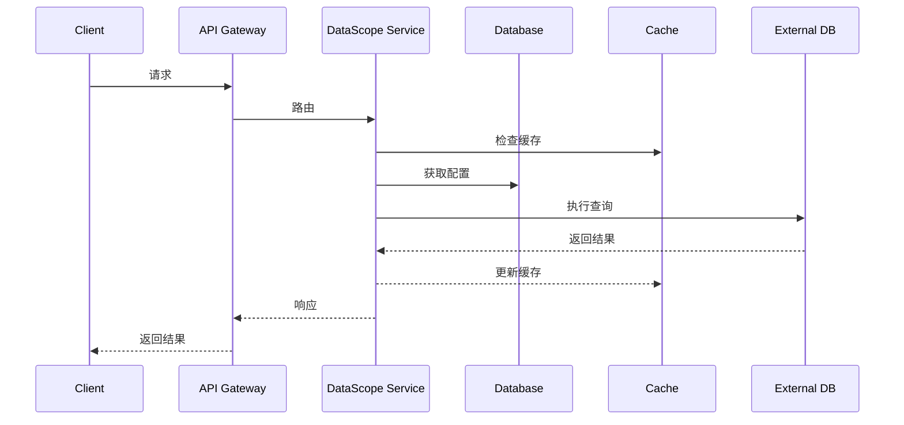

# 系统架构设计

## 1. 模块划分 (DDD分层)

```
datascope/
├── app/                    # 应用层
│   ├── assembler/         # DTO转换
│   ├── command/          # 命令处理
│   ├── query/           # 查询处理
│   └── service/         # 应用服务
├── domain/                # 领域层
│   ├── model/           # 领域模型
│   ├── repository/      # 仓储接口
│   └── service/        # 领域服务
├── facade/                # 接口层
│   ├── api/             # API接口
│   ├── dto/            # 数据传输对象
│   └── converter/      # 对象转换器
├── infrastructure/        # 基础设施层
│   ├── config/         # 配置
│   ├── persistence/    # 持久化实现
│   ├── integration/    # 外部集成
│   └── common/        # 公共组件
└── main/                 # 启动模块
```

## 2. 核心功能模块

1. 数据源管理模块
   - 数据源配置管理
   - 连接池管理
   - 元数据同步

2. 元数据管理模块
   - 表结构管理
   - 字段信息管理
   - 关系管理

3. 查询管理模块
   - SQL生成
   - 查询执行
   - 结果处理

4. 低代码配置模块
   - 界面配置
   - 组件映射
   - 显示规则

5. AI 辅助模块
   - 智能推荐
   - 关系推断
   - 自然语言处理

6. 系统管理模块
   - 监控告警
   - 日志管理
   - 性能优化

## 3. 技术选型

1. 核心框架
   - Spring Boot 2.7.x
   - MyBatis 3.5.x
   - Maven 3.8.x

2. 数据库
   - MySQL 8.0
   - Redis 6.x

3. 工具库
   - Lombok
   - MapStruct
   - HikariCP
   - Swagger/OpenAPI 3.0

4. 监控和日志
   - Spring Boot Actuator
   - SLF4J + Logback
   - Prometheus + Grafana

## 4. 系统交互

