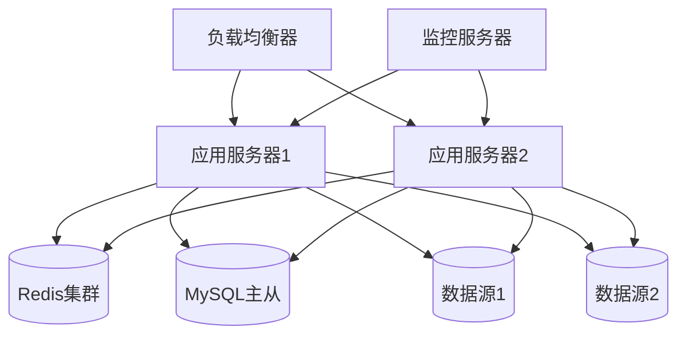

# 部署架构

## 1. 系统架构图



## 2. 部署配置

### 2.1 应用服务器配置

```yaml
# application-prod.yml
server:
  port: 8080
  tomcat:
    max-threads: 200
    min-spare-threads: 20
    max-connections: 10000
    accept-count: 100

spring:
  datasource:
    url: jdbc:mysql://master:3306/datascope
    username: ${MYSQL_USER}
    password: ${MYSQL_PASSWORD}
    hikari:
      maximum-pool-size: 20
      minimum-idle: 5
      idle-timeout: 300000
      
  redis:
    cluster:
      nodes:
        - redis-node1:6379
        - redis-node2:6379
        - redis-node3:6379
    password: ${REDIS_PASSWORD}
    
datascope:
  encryption:
    key: ${ENCRYPTION_KEY}
  query:
    max-timeout: 120
    default-timeout: 30
  cache:
    metadata-ttl: 3600
    query-result-ttl: 300
```

### 2.2 Docker配置

```dockerfile
# Dockerfile
FROM openjdk:17-slim

WORKDIR /app

COPY target/datascope.jar /app/
COPY config/ /app/config/

ENV JAVA_OPTS="-Xms2g -Xmx4g -XX:MetaspaceSize=128m -XX:MaxMetaspaceSize=256m"
ENV SPRING_PROFILES_ACTIVE="prod"

EXPOSE 8080

ENTRYPOINT ["sh", "-c", "java $JAVA_OPTS -jar datascope.jar"]
```

### 2.3 Docker Compose配置

```yaml
# docker-compose.yml
version: '3.8'

services:
  app:
    build: .
    image: datascope:latest
    ports:
      - "8080:8080"
    environment:
      - SPRING_PROFILES_ACTIVE=prod
      - MYSQL_USER=datascope
      - MYSQL_PASSWORD=secret
      - REDIS_PASSWORD=secret
      - ENCRYPTION_KEY=secret
    volumes:
      - ./logs:/app/logs
    depends_on:
      - mysql
      - redis
    deploy:
      replicas: 2
      resources:
        limits:
          cpus: '2'
          memory: 4G
        reservations:
          cpus: '1'
          memory: 2G
          
  mysql:
    image: mysql:8.0
    ports:
      - "3306:3306"
    environment:
      - MYSQL_ROOT_PASSWORD=root
      - MYSQL_DATABASE=datascope
      - MYSQL_USER=datascope
      - MYSQL_PASSWORD=secret
    volumes:
      - mysql_data:/var/lib/mysql
    command: --default-authentication-plugin=mysql_native_password
      
  redis:
    image: redis:6.2
    ports:
      - "6379:6379"
    command: redis-server --requirepass secret
    volumes:
      - redis_data:/data

volumes:
  mysql_data:
  redis_data:
```

## 3. 监控配置

### 3.1 Prometheus配置

```yaml
# prometheus.yml
global:
  scrape_interval: 15s
  evaluation_interval: 15s

scrape_configs:
  - job_name: 'datascope'
    metrics_path: '/actuator/prometheus'
    static_configs:
      - targets: ['app1:8080', 'app2:8080']
    
  - job_name: 'node-exporter'
    static_configs:
      - targets: ['node-exporter:9100']

alerting:
  alertmanagers:
    - static_configs:
        - targets: ['alertmanager:9093']

rule_files:
  - 'alert.rules.yml'
```

### 3.2 Grafana配置

```yaml
# grafana/provisioning/datasources/datasource.yml
apiVersion: 1

datasources:
  - name: Prometheus
    type: prometheus
    access: proxy
    url: http://prometheus:9090
    isDefault: true
```

## 4. 高可用配置

### 4.1 Nginx负载均衡配置

```nginx
# nginx.conf
upstream datascope {
    server app1:8080;
    server app2:8080;
    keepalive 32;
}

server {
    listen 80;
    server_name datascope.company.com;
    
    location / {
        proxy_pass http://datascope;
        proxy_http_version 1.1;
        proxy_set_header Upgrade $http_upgrade;
        proxy_set_header Connection 'upgrade';
        proxy_set_header Host $host;
        proxy_cache_bypass $http_upgrade;
        
        # 超时设置
        proxy_connect_timeout 60s;
        proxy_send_timeout 60s;
        proxy_read_timeout 60s;
    }
    
    # 健康检查
    location /health {
        proxy_pass http://datascope/actuator/health;
        proxy_http_version 1.1;
        proxy_set_header Host $host;
        
        access_log off;
        allow 127.0.0.1;
        deny all;
    }
}
```

### 4.2 Redis集群配置

```yaml
# redis-cluster.yml
port 6379
cluster-enabled yes
cluster-config-file nodes.conf
cluster-node-timeout 5000
appendonly yes
protected-mode no
requirepass ${REDIS_PASSWORD}
masterauth ${REDIS_PASSWORD}
```

## 5. 安全配置

### 5.1 SSL配置

```yaml
# application-ssl.yml
server:
  ssl:
    key-store: classpath:keystore.p12
    key-store-password: ${SSL_KEY_STORE_PASSWORD}
    key-store-type: PKCS12
    key-alias: datascope
    enabled: true
```

### 5.2 安全Headers配置

```yaml
# application-security.yml
security:
  headers:
    content-security-policy: default-src 'self'
    x-frame-options: DENY
    x-content-type-options: nosniff
    x-xss-protection: 1; mode=block
    strict-transport-security: max-age=31536000; includeSubDomains
```

## 6. 备份策略

### 6.1 数据库备份脚本

```bash
#!/bin/bash
# backup.sh

# 配置
BACKUP_DIR="/backup/mysql"
MYSQL_USER="backup"
MYSQL_PASSWORD="backup_password"
RETENTION_DAYS=7

# 创建备份目录
mkdir -p $BACKUP_DIR

# 备份文件名
BACKUP_FILE="$BACKUP_DIR/datascope_$(date +%Y%m%d_%H%M%S).sql.gz"

# 执行备份
mysqldump -u$MYSQL_USER -p$MYSQL_PASSWORD --single-transaction \
  --databases datascope | gzip > $BACKUP_FILE

# 删除旧备份
find $BACKUP_DIR -name "datascope_*.sql.gz" -mtime +$RETENTION_DAYS -delete
```

### 6.2 Redis备份配置

```yaml
# redis.conf
save 900 1
save 300 10
save 60 10000
dir /data
dbfilename dump.rdb
```

## 7. 部署流程

### 7.1 部署检查清单

```yaml
pre_deploy:
  - 检查系统资源
  - 备份数据库
  - 验证配置文件
  - 准备回滚方案

deploy:
  - 停止服务
  - 更新应用
  - 执行数据库迁移
  - 启动服务
  - 验证服务状态

post_deploy:
  - 监控系统指标
  - 验证功能可用性
  - 清理临时文件
  - 更新文档
```

### 7.2 自动化部署脚本

```bash
#!/bin/bash
# deploy.sh

# 配置
APP_NAME="datascope"
DEPLOY_DIR="/opt/datascope"
BACKUP_DIR="/backup/datascope"
LOG_FILE="/var/log/datascope/deploy.log"

# 日志函数
log() {
    echo "$(date '+%Y-%m-%d %H:%M:%S') $1" >> $LOG_FILE
}

# 前置检查
pre_deploy() {
    log "开始部署前检查"
    
    # 检查系统资源
    DISK_USAGE=$(df -h | awk '$NF=="/"{print $5}' | sed 's/%//')
    if [ $DISK_USAGE -gt 80 ]; then
        log "错误: 磁盘使用率过高 ($DISK_USAGE%)"
        exit 1
    fi
    
    # 备份当前版本
    mkdir -p $BACKUP_DIR
    tar -czf $BACKUP_DIR/$APP_NAME-$(date +%Y%m%d_%H%M%S).tar.gz $DEPLOY_DIR
    
    log "部署前检查完成"
}

# 部署
deploy() {
    log "开始部署"
    
    # 停止服务
    systemctl stop $APP_NAME
    
    # 更新应用
    cp target/$APP_NAME.jar $DEPLOY_DIR/
    cp -r config/* $DEPLOY_DIR/config/
    
    # 启动服务
    systemctl start $APP_NAME
    
    # 等待服务启动
    sleep 10
    
    # 检查服务状态
    if systemctl is-active $APP_NAME >/dev/null 2>&1; then
        log "部署成功"
    else
        log "错误: 服务启动失败"
        rollback
        exit 1
    fi
}

# 回滚
rollback() {
    log "开始回滚"
    
    # 获取最新备份
    LATEST_BACKUP=$(ls -t $BACKUP_DIR/*.tar.gz | head -1)
    
    # 恢复备份
    tar -xzf $LATEST_BACKUP -C /
    
    # 重启服务
    systemctl restart $APP_NAME
    
    log "回滚完成"
}

# 主流程
main() {
    log "开始部署流程"
    
    pre_deploy
    deploy
    
    log "部署流程完成"
}

main
```